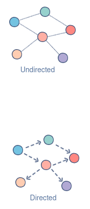

# Getting Started

DAGs
- Directed Acyclic Graph
- Collection of all the tasks and their dependencies as code
- DAG files are Python scripts
- Configuration specifying the 

## Task Stages and Lifecycle


- **No Status** Scheduler created empty task instance
- **Scheduled** Scheduler determined task instance needs to run
- **Queued** Scheduler sent task to executor to run on the queue
- **Running** Worker picked up a task and is now running it
- **Success** Task is completed

## Steps to Writing Airflow DAGs
- Step 1: Importing modules
- Step 2: Default Arguments
- Step 3: Instantiate a DAG
- Step 4: Tasks
- Step 5: Setting up Dependencies


## DAGS as a Concept

### Understanding Graph Data Structures

A Graph is 
- Non-linear data structure
- Consists of nodes (also often referred as vertices) and edges


Note:
- The set of vertices V = {0,1,2,3,4} 
- The set of edges    E = {01, 12, 23, 34, 04, 14, 13}
- Example above is a an undirected graph (Nodes are all connected in a bidirectional fashion)

#### Directed Graph

- Nodes are connected by directed edges, they only go in one direction
- **DAGs in Apache Airflow are Directed Graphs**



## Operators and Tasks

- **DAGs** do not perform any computation
- **Operators** determine what actually gets done
- **Task** An operator that has be instantiated. Referred to as a task
- A **DAG** is a container. 
> - Used to organize tasks and set their execution context

```python
from airflow.operators.bash_operator import BashOperator
from airflow import DAG

from datetime import timedelta

default_args = {
    'owner': 'ydot19',
    'depends_on_past': False,
    'email': ['ydot19@example.com'],
    'email_on_failure': False,
    'email_on_retry': False,
    'retries': 1,
    'retry_delay': timedelta(minutes=5)
}

dag = DAG(
    dag_id='tutorial',
    default_args=default_args,
    description='A simple tutorial dag',
    schedule_interval=timedelta(days=1)
)

t1 = BashOperator(
    task_id="print_date",
    bash_command="date",
    dag=dag,
)

t2 = BashOperator(
    task_id='sleep',
    depends_on_past=False,
    bash_command='sleep 5' # sleeps for 5 seconds
)

# [START jinja_template commands]
template_command = """

    echo "{{ ds }}"
    echo "{{ macros.ds_Add(ds,6) }}"
    echo "{{ params.my_param}}"

""" 

t3 = BashOperator(
    task_id='templated',
    depends_on_past=False,
    bash_command=template_command,
    params = {'my_param': 'Paramter I Passed In'},
    dag=dag,
)
```

### Operator Categories

Operators are classified into three categories
- Sensors
> - Certain type of operator
> - Will keep running until a certain criteria is met
> - Example: 
>   - Wait criteria for certain time
>   - Waiting on an external file
>   - Upstream data
>       - HdfsSensor: Waits for a file or folder to land in HDFS
>       - NamedHivePartitionSensor: Check whether the most recent partition of a Have table is available for downstream processing

- Operators
> - Triggers a certain action (e.g. run a bash command, execute a python function, execute a Hive query)
>   - BashOperator: executes a bash command
>   - PythonOperator: calls an arbitrary python function
>   - HiveOperator: Executes hql code or hive script in a specific Hive database
>   - BigQueryOperator: executes Google BigQuery SQL queries in a specific BigQuery database
- Transfers
> - Moves data from one location to another
>   - MySqlToHiveTransfer
>   - S3ToRedshiftTransfer

## DagRuns and TaskInstances

- **execution_time**: The execution times of a DAG begin at DAG's start_date and repeat every **schedule_interal**
- **DagRuns**: DAGs that runs at a certain time
- **TaskInstances** are the tasks that belong to that DagRuns
    - Each **DagRun** is associated with an entry in Airflow's metadata database that logs their state
    - **queued**, **running**, **failed**, **skipped**, **up for entry**
